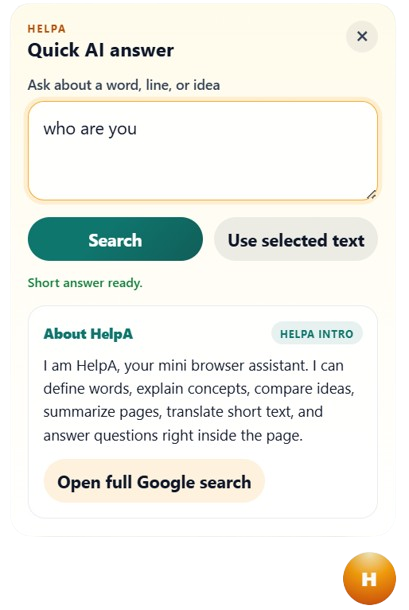

# HelpA — Quick Search Chrome Extension

> **Stop opening extra tabs just to look up a term.**



---

## 💡 Why I Built This

While reading articles, research papers, or anything on the web, we often come across **difficult words, technical terms, or concepts** we don't understand. The usual solution? Open a new tab, search it, and lose your reading flow.

**HelPA fixes that.**

Just open the extension, type the word or term you want to understand, and get a clear, short answer — right inside the popup. No extra tabs. No distractions. Keep reading.

---

## ✨ Features

- 🔍 **Instant answers** from DuckDuckGo (first priority)
- 📖 **Dictionary definitions** for single words
- 📚 **Wikipedia summaries** as a fallback (only when strongly relevant)
- 🔄 **Synonym finder** — find related words fast
- ⚖️ **Compare mode** — e.g. "TCP vs UDP", "OOP vs functional"
- 🧠 **Explain Simply** — beginner-friendly explanations
- 📝 **Summarize mode** — summarize the current page's content
- 🌐 **Translate** — translate text to Urdu, Hindi, Arabic, Spanish
- 🔗 **Open in Google** — jump to a full Google search if needed

---

## 🔎 How Search Works (Priority Order)

| Priority | Source | Used For |
|---|---|---|
| 1st | DuckDuckGo Instant API | Fast facts, definitions, general queries |
| 2nd | DuckDuckGo Web Search | Fallback when instant API has no result |
| 3rd | Dictionary API | Single-word definitions |
| 4th | Wikipedia | Last resort — only when strongly topic-matched |

Wikipedia is used **last** and only shown when the result is actually about what you searched. This avoids off-topic answers (e.g. searching "Inheritance in C++" won't return a generic C language page anymore).

---

## 🚀 How to Install (Developer Mode)

Since this extension is not yet on the Chrome Web Store, you can load it manually:

1. **Download or clone this repo**
   ```
   git clone https://github.com/YOUR_USERNAME/HelpA.git
   ```

2. **Open Chrome** and go to:
   ```
   chrome://extensions
   ```

3. **Enable Developer Mode** — toggle it on (top-right corner)

4. Click **"Load unpacked"**

5. Select the **HelpA folder** (the one containing `manifest.json`)

6. The extension icon will appear in your Chrome toolbar ✅

---

## 🧭 How to Use

1. **Click the HelpA icon** in the Chrome toolbar to open the popup

2. **Choose a mode** (Auto is fine for most searches):
   - `Auto` — automatically picks the best search strategy
   - `Define` — get the dictionary meaning of a word
   - `Synonyms` — find words with similar meaning
   - `Compare` — compare two terms (e.g. "RAM vs ROM")
   - `Explain Simply` — get a beginner-friendly answer
   - `Summarize` — summarize the page you're reading
   - `Translate` — translate a word or phrase

3. **Type your query** in the text box
   - Example: `What is polymorphism?`
   - Example: `inheritance in C++`
   - Example: `difference between TCP and UDP`

4. Press **Enter** or click **Search**

5. Read the short answer — the **name tags** tells you which source answered:
   - DuckDuckGo
   - Wikipedia
   - Dictionary
   - Datamuse (synonyms)

6. If you need more detail, click **"Open full Google search"**

---

## 📁 Project Structure

```
HelpA/
├── manifest.json       # Extension config & permissions
├── background.js       # Core search logic (all APIs)
├── popup.html          # Extension popup UI
├── popup.js            # Popup interactions & rendering
├── popup.css           # Popup styles
├── content.js          # Injected page script (selected text)
├── content.css         # Content script styles
├── options.html        # Settings page
└── options.js          # Settings logic
```

---

## 🛠️ Tech Stack

- **Manifest V3** Chrome Extension
- **Vanilla JS** — no frameworks, fast and lightweight
- **APIs used** (all free, no API key needed):
  - [DuckDuckGo Instant Answer API](https://api.duckduckgo.com/)
  - [Free Dictionary API](https://dictionaryapi.dev/)
  - [Datamuse API](https://www.datamuse.com/api/) — synonyms
  - [Wikipedia REST API](https://en.wikipedia.org/api/rest_v1/)
  - [MyMemory Translation API](https://mymemory.translated.net/)

---

## 📌 Tips

- **Selected text**: If you highlight a word on the page before opening the popup, it may be used as context for your search.
---

## 🤝 Contributing

Pull requests are welcome! If you find a bug or have an idea for a new feature, feel free to open an issue.

---

## 📄 License

MIT License — free to use.

---

*Built to make studying and reading on the web a smoother experience.* 📚
